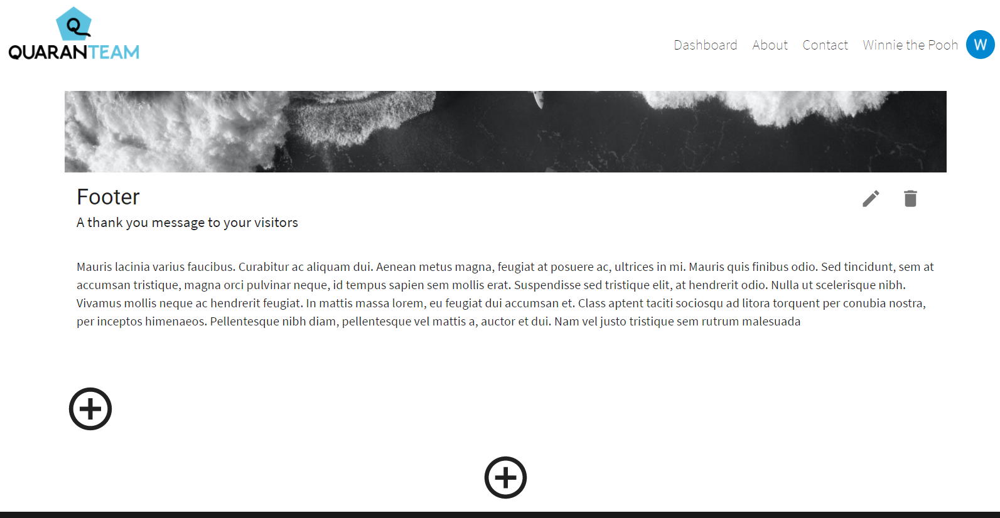

    Users could add empty items to new ePortfolio by clicking
    '+' sign.                                            
                                               
    Items could be added horizontally or vertically.               

 
