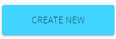
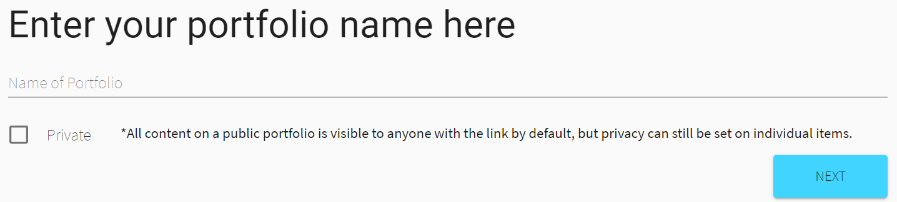
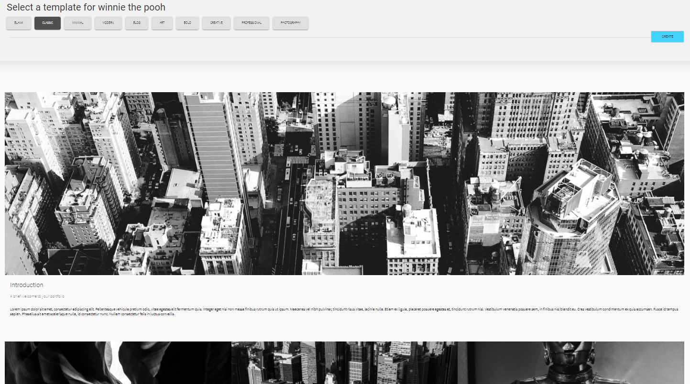

Create ePortfolios                
     
                   
In the dashboard, users have the option to create new ePortfolios by clicking 'CREATE NEW' sign.                              
                     
                                    

                                            
Users could set the name and privacy of ePortfolio.                           
                    
                                                

                                            
We provide many templates for the convenience of users. In addition to that, a completely blank templates is available if users prefer designing their own ePortfolios.                            
                                                       

                                                  
                                          