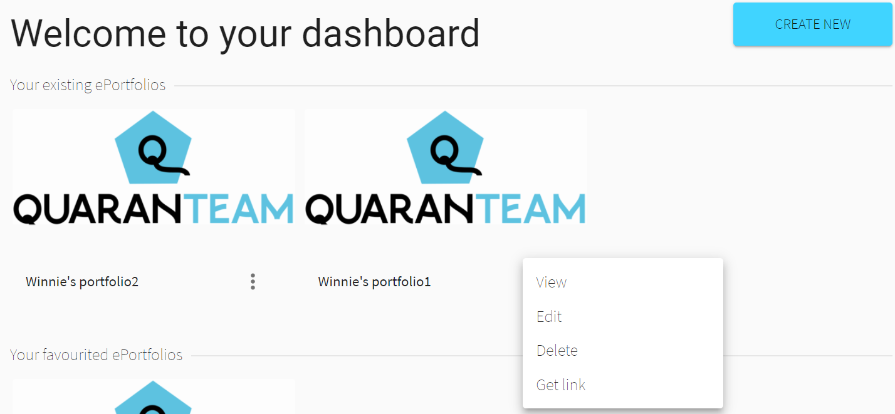
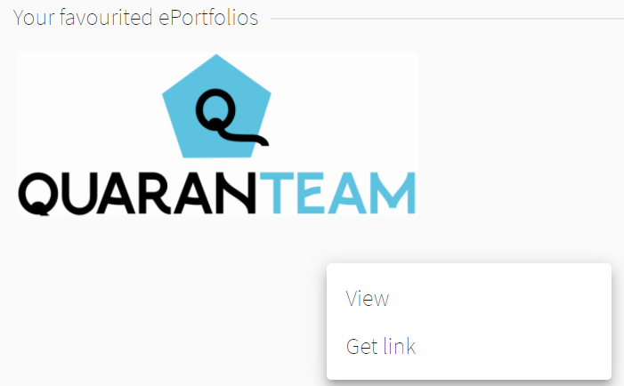

Users could access the dashboard after login.              
The dashboard contains all existing ePortfolios and favourited ePortfolios made by others or user himself/herself.       
                   
                       
                          
    existing ePortfolios functions:           
        -view             
        -edit                 
        -delete                    
        -get link                          

                                    
                         
                          
                                  
    favourited ePortfolios functions:   
        -view                                
        -get link                                  
                              
           