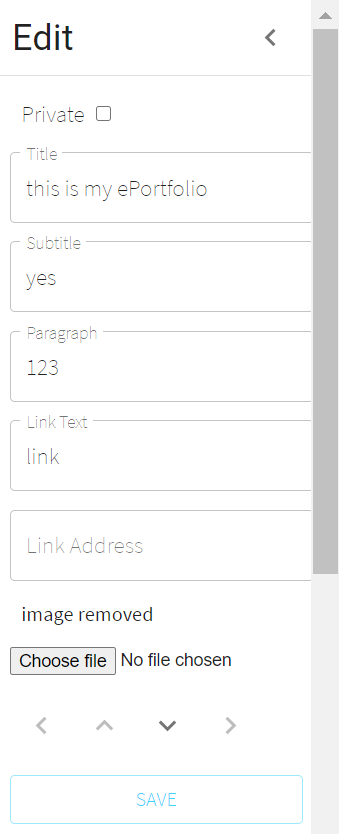
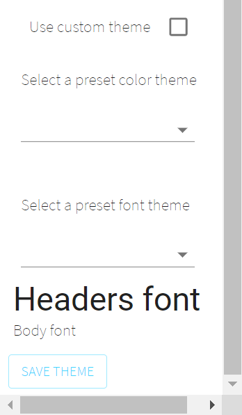
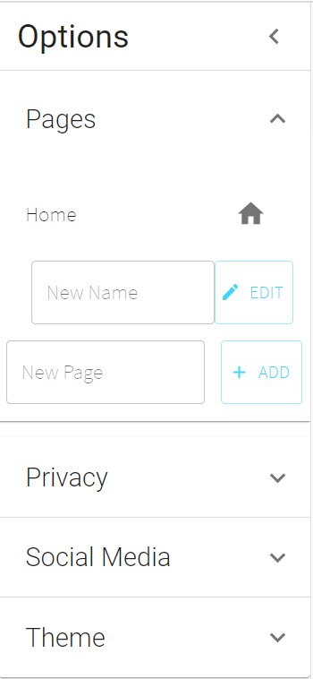
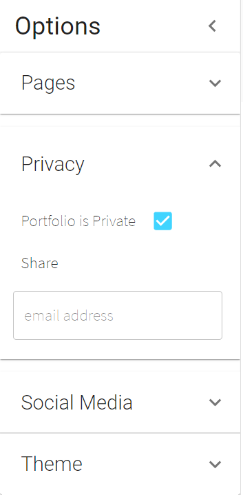
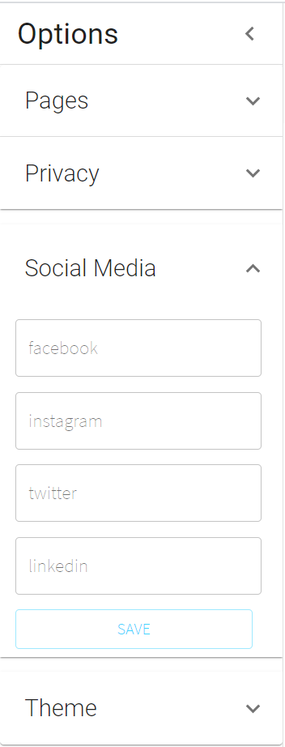
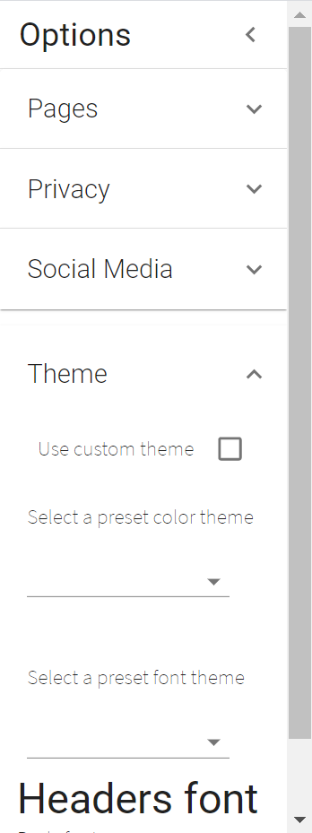
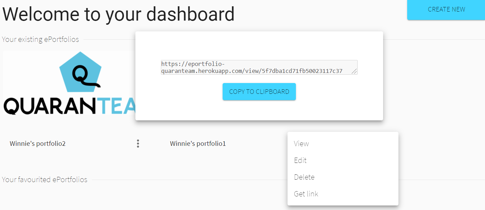

Create ePortfolios     
In the dashboard, users have the option to create new ePortfolios by clicking 'CREATE NEW' sign.    

     

We provide many templates for the convenience of users. In addition to that, a completely blank templates is available if users prefer designing their own ePortfolios.    

Edit ePortfolios    
Each ePortfolio contains lots of items. Users could edit each items using tools available in the sidebar. Texts, images, links, privacy....could be set in the items.         

Options    

View ePortfolios     
Users could right click on ePortfolios in dashboard and select view to view ePortfolios.     

-Save favourite ePortfolios    
click on the star to save your favourite portfolios

-Write comments
Users could edit or delete comments on items.

Share ePortfolio links     
By clicking 'get link' from each ePortfolio in the dashboard, users could share their ePortfolios with others.

